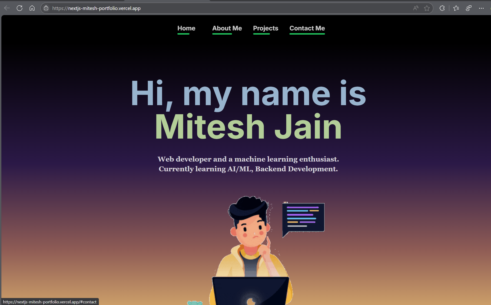

# Mitesh's Portfolio Website



A modern, responsive personal portfolio website built with Next.js to showcase my projects, skills, and professional experience.

## ✨ Features

- **Responsive Design**: Looks great on all devices - mobile, tablet, and desktop
- **Skills Section**: Visual representation of technical skills and proficiency
- **Contact Form**: Allow visitors to reach out directly from the website
- **Fast Performance**: Optimized loading times with Next.js

## 🛠️ Tech Stack

- [Next.js](https://nextjs.org/) - React framework
- [React](https://reactjs.org/) - JavaScript library for building user interfaces
- [TypeScript](https://www.typescriptlang.org/) - Static type checking
- [Tailwind CSS](https://tailwindcss.com/) - Utility-first CSS framework
- [Framer Motion](https://www.framer.com/motion/) - Animation library
- [React Icons](https://react-icons.github.io/react-icons/) - Icon library
- [Vercel](https://vercel.com/) - Deployment platform

## 🚀 Getting Started

### Prerequisites

- Node.js (v14+)
- npm or yarn

### Installation

1. Clone the repository:
   ```bash
   git clone https://github.com/MiteshJain8/nextjs_mitesh_portfolio.git
   cd nextjs_mitesh_portfolio
   ```

2. Install dependencies:
   ```bash
   npm install
   # or
   yarn install
   ```

3. Start the development server:
   ```bash
   npm run dev
   # or
   yarn dev
   ```

4. Open [http://localhost:3000](http://localhost:3000) in your browser to see the result.

## 🔧 Customization

To make this portfolio your own:

1. Update the personal information in `data/profile.js`
2. Replace project data in `data/projects.js`
3. Modify the skills list in `data/skills.js`
4. Add your own images to the `public/images/` directory
5. Customize the color scheme in `tailwind.config.js`

## 📝 License

This project is open source and available under the [MIT License](LICENSE).

## 📞 Contact

Feel free to reach out if you have any questions or suggestions:

- **Email**: [miteshjain2808@gmail.com](mailto:miteshjain2808@gmail.com)
- **LinkedIn**: [linkedin.com/in/miteshjain8](https://linkedin.com/in/miteshjain8)

---

Built with ❤️ by [Mitesh Jain](https://github.com/MiteshJain8) and Next.js. 🚀
